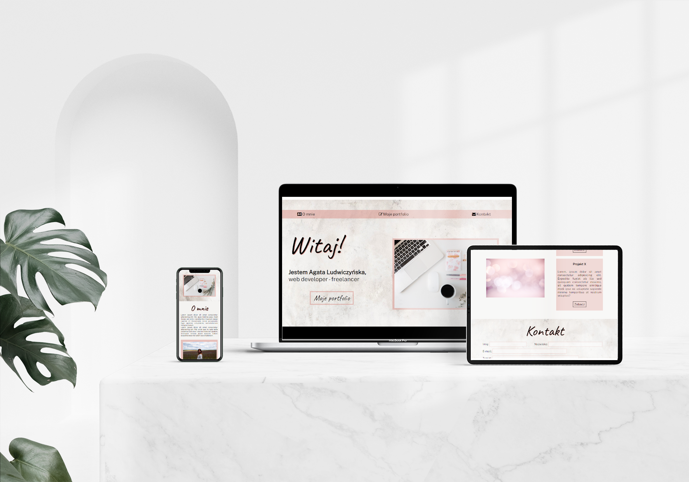
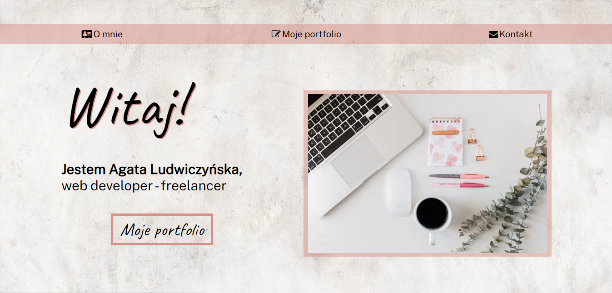
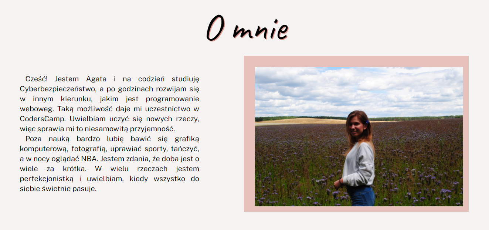
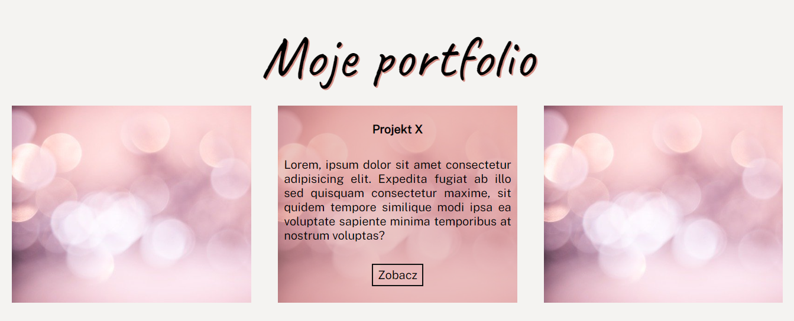
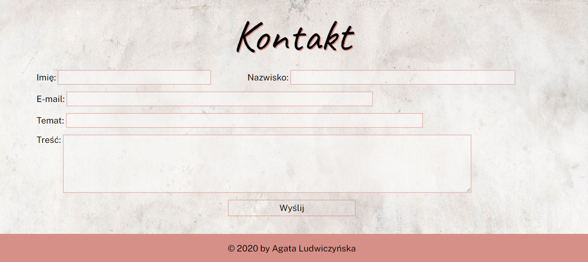

# CodersCamp 2020 - Projekt HTML & CSS
Demo mojego projektu: https://agataludwiczynska.github.io/CodersCamp2020.Project.HTML-CSS.BusinessCard/

## Wizytówka / Portfolio

Strona ta jest szablonem portfolio, który jest w pełni responsywny, dzięki czemu dobrze wygląda na różynych urządzeniach. 

Na stronie znajdziemy nagłówek z menu, które prowadzi nas do poszczególnych sekcji strony.

Sekcje, w której możliwe jest opisanie właściciela strony oraz zamieszczenie jej zdjęcia.

Portfolio z przykładowymi projektami, po najechaniu na nie, możemy przeczytać o szczegółach zamieszczonych prac.

Na samym końcu znajduje się formularz kontaktowy.

## Wykorzystane technologie:
CSS i HTML

### Zagadnienia wykorzystane z tych technologii, to między innymi:
- Box-model
- Jak podpinać CSSa do HTMLa
- Zapisywanie kolorów
- Zewnętrzne ikony/fonty (fontawesome, google fonts)
- Flexbox i/lub CSS Grid
- Position (absolute, relative)
- Formularz
- Responsive Web Design

Strona jest ukończona i w pełni wykonana przez autora projektu. 